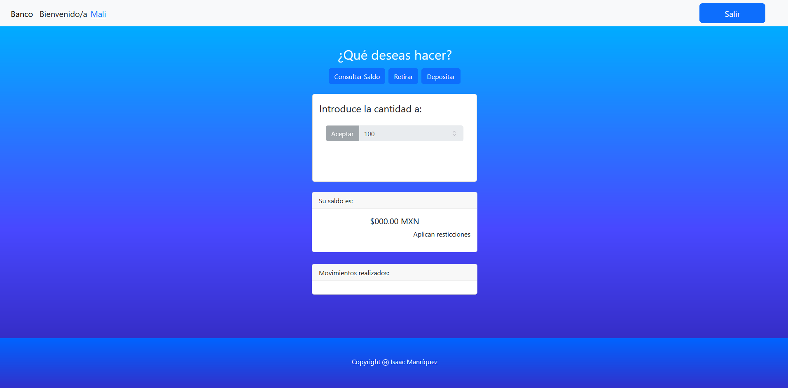

# Simulador de Banco

Aplicación simulador de ingreso al portal de banco realizada en JS, HTML y CSS con los frameworks de Boostrap 5.5 (cdn) y alertas con Sweetalert2.

## Accede la app de Banco en el siguiente [Simulador de Banco](https://isaacmb-alfa.github.io/app-banco/).

## Descripción

Esta aplicación esta construida con vanila JavaScript en su mayor parte.


## Visuales de la app

<div aling="center">
    
    </br>
    <hr>
    
</div>

---

### Modo de empleo 🔧

La app tiene registrados 3 usuarios, los cuales tienen acceso a todas las funciones de la app.

Nombres de usuario : Mali, Maui, Gera

Contraseñas para los 3 usuarios: "12345".


### Usuario
```bash
Mali
```

### Contraseña
```bash
12345
```
Posterior al ingreso correcto recibimos una alerta de inicio satisfactorio y ya nos permite realizar entre 3 tipos de movimientos, 

Consultar saldo, Retirar, Depositar.

Despues de realizar ya sea retiro o depósito podemos ver los movimientos en la parte inferior ordenados del más viejo al más nuevo de manera decendente.

---

⌨️ con ❤️ por [Isaac Manríquez](https://github.com/isaacmb-alfa) 😊